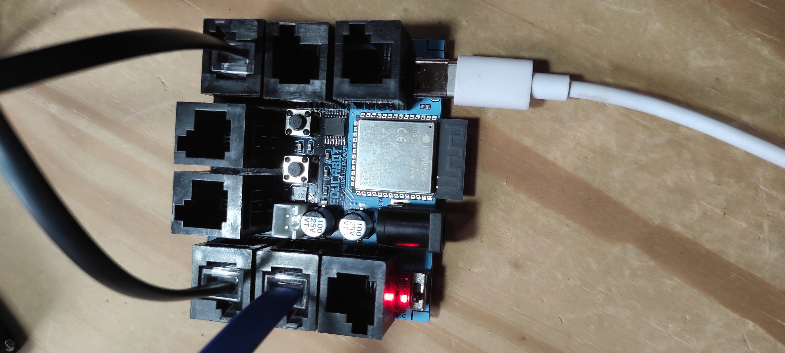
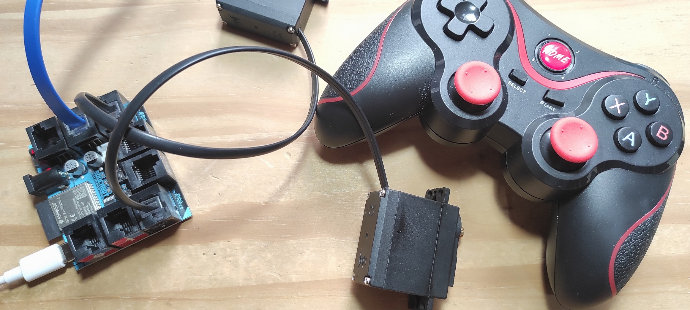

# EducaBot v2 — Robot educativo de tracción diferencial con joystick Bluetooth

**Autor:** Prof. Fernando Angel Liozzi — 2026

Robot tipo autito de **tracción diferencial** (2 motores DC) controlado de
forma inalámbrica por un **joystick Bluetooth BLE** tipo PlayStation. Funciona
sobre un **ESP32-S3** y utiliza **4 bibliotecas propias** desarrolladas
íntegramente para este proyecto.

| Componente         | Detalle                                            |
| ------------------ | -------------------------------------------------- |
| **Placa**          | ESP32-S3-WROOM-2 (solo BLE, sin Bluetooth Classic) |
| **Driver motores** | HR8833 (puente H doble)                            |
| **Motores**        | 2 motores DC en configuración diferencial          |
| **Iluminación**    | Tira de 6 LEDs WS2812 (NeoPixel)                   |
| **Control**        | Joystick GamePadPlus V3 por BLE (modo Home + X)    |
| **Framework**      | Arduino sobre PlatformIO                           |

---

## 🔌 Placa EduPlugPower

Placa educativa utilizada en la **Copa Robótica Educabot 2026**
([coparobotica.com](https://www.coparobotica.com/)). Integra el ESP32-S3, el
driver HR8833, regulador de tensión y conectores para motores y sensores en
un solo módulo compacto.

<p align="center">
  
  &nbsp;&nbsp;
  
</p>

### Conectores y pines

La placa dispone de **8 conectores RJ11 6P6C** que incluyen entradas, salidas,
motores, servos y bus I²C, más un **header de 2 pines para speaker**.

| Conector    | GPIO / Pin       | Función                  |
| ----------- | ---------------- | ------------------------ |
| **0**       | 4                | Entrada/sensor digital   |
| **1**       | 8                | Entrada/sensor digital   |
| **2**       | 2                | Tira WS2812 (NeoPixel)   |
| **I²C**     | SDA/SCL          | Bus I²C para sensores    |
| **SAT1**    | 15               | Servo de potencia 1      |
| **SAT2**    | 15               | Servo de potencia 2      |
| **MD**      | BIN1=41, BIN2=42 | Motor derecho (HR8833)   |
| **MI**      | AIN1=39, AIN2=40 | Motor izquierdo (HR8833) |
| **Speaker** | Header 2 pines   | Salida de audio          |

> Todos los conectores de E/S son RJ11 6P6C: evitan inversión de polaridad y
> son ideales para entornos educativos. Los conectores SAT1/SAT2 están
> diseñados para servos de potencia con alimentación independiente.

---

## 🎮 Controles del robot

| Control                | Acción                                                                        |
| ---------------------- | ----------------------------------------------------------------------------- |
| **Stick derecho (RY)** | Avance / reversa                                                              |
| **Stick derecho (RX)** | Giro izquierda / derecha                                                      |
| **L1**                 | 🔒 Bloquea el giro (fuerza RX = centro)                                       |
| **R1**                 | 🔒 Bloquea avance/reversa (fuerza RY = centro)                                |
| **Y**                  | ⏯️ Toggle de **paro total enclavado** (freno activo)                          |
| **L2 (analógico)**     | 🎯 Atenuador de velocidad: suelto = máxima potencia, a fondo = modo precisión |

### Indicadores LED de estado

| LED                         | Significado                       |
| --------------------------- | --------------------------------- |
| 🔴 LED ① fijo               | Giro bloqueado (L1 presionado)    |
| 🔴 LED ⑥ fijo               | Avance bloqueado (R1 presionado)  |
| 🟠 LEDs ② y ⑤ intermitentes | Paro total activo (Y enclavado)   |
| 🌈 Arcoíris giratorio       | Escaneando joystick BLE           |
| 🟢 Pulso verde + fade-out   | Conexión establecida              |
| ⚫ Todos apagados           | Operación normal (ahorro batería) |

---

## 🧩 Bibliotecas propias

El proyecto se compone de **4 bibliotecas originales** (en `lib/`):

| Biblioteca            | Responsabilidad                                                                                                                  |
| --------------------- | -------------------------------------------------------------------------------------------------------------------------------- |
| **JoystickBLE**       | Ciclo de vida BLE completo: escaneo, bonding seguro (sin IRK), conexión, reconexión automática, suscripción a notificaciones HID |
| **GamepadData**       | Parseo del report HID de 10 bytes: 4 ejes, D-pad, 12 botones, gatillos L2/R2 duales (analógico + digital)                        |
| **DifferentialDrive** | Tracción diferencial con mezcla arcade, normalización anti-saturación, deadzone, atenuación L2, modos de decaimiento Slow/Fast   |
| **NeoPixelEffects**   | 3 efectos en tira WS2812 de 6 LEDs: arcoíris giratorio (escaneo), pulso verde (conexión), indicadores rojo/ámbar (bloqueos)      |

### Documentación detallada

Cada biblioteca tiene su propia documentación en `docs/`:

- [`DifferentialDrive.md`](docs/DifferentialDrive.md) — mezcla arcade, modos PWM, frenado
- [`JoystickBLE.md`](docs/JoystickBLE.md) — arquitectura BLE, seguridad, reconexión
- [`NeoPixelEffects.md`](docs/NeoPixelEffects.md) — efectos de iluminación y estados

---

## 🔌 Pinout

| GPIO | Función           | Notas                   |
| ---- | ----------------- | ----------------------- |
| 2    | WS2812 (NeoPixel) | Tira de 6 LEDs          |
| 39   | Motor izq. IN1    | Canal LEDC 0            |
| 40   | Motor izq. IN2    | Canal LEDC 1            |
| 41   | Motor der. IN1    | Canal LEDC 2            |
| 42   | Motor der. IN2    | Canal LEDC 3, invertido |

---

## ⚙️ Tracción diferencial

El robot usa **mezcla arcade**: un solo stick (derecho) controla avance/reversa
(RY) y giro (RX) simultáneamente. El algoritmo:

1. Convierte cada eje a valor signed con **deadzone** (±16 alrededor del centro 128)
2. Calcula: `motorIzq = avance + giro`, `motorDer = avance - giro`
3. **Normaliza** para que ningún motor sature, preservando la relación de velocidades
4. Aplica **atenuación por L2**: interpola linealmente el PWM máximo entre 255 (L2=0, máxima potencia) y 150 (L2=255, modo precisión al 59%)
5. Escribe los PWM por hardware (LEDC) al HR8833

### Modos de decaimiento

| Modo     | Comportamiento                                             | Uso ideal              |
| -------- | ---------------------------------------------------------- | ---------------------- |
| **Slow** | Torque sostenido, movimiento muy suave a bajas velocidades | Precisión (L2 a fondo) |
| **Fast** | Frenado dinámico, respuesta rápida a cambios               | Alta velocidad         |

> ⚠️ Actualmente el decay mode está fijo en **Slow**. El cambio dinámico
> (Fast a alta velocidad → Slow en precisión) está planeado para v3.14.

###🛑 Paro total (Y)

Cuando se presiona Y, se activa un **freno enclavado**: ambos canales de cada
motor reciben `pwmMax` → el HR8833 cortocircuita los motores → freno activo.
Se libera volviendo a presionar Y (toggle con detección de flanco).

---

## 📡 Conexión BLE

Lo que hace falta para que enganche de forma confiable (ya resuelto en el
código):

1. `NimBLEDevice::setSecurityAuth(true, false, true)` — activa **bonding**. Sin
   emparejamiento cifrado, el gamepad HID no envía los reports de botones/ejes.
2. `NimBLEDevice::deleteAllBonds()` al arrancar — borra emparejamientos viejos.
   Un bond previo dejaba el anuncio con dirección `00:00:00:00:00:00` y la
   conexión fallaba con _"Invalid peer address"_.
3. Se guarda el **objeto** del anuncio y se conecta por él (no por la dirección
   extraída), así se conserva el tipo real de dirección aunque se vea nula.
4. Reconexión automática: si el mando se desconecta, vuelve a escanear solo.
5. **Seguridad sin IRK**: solo se intercambia clave de cifrado (ENC), sin
   Identity Resolving Key. Esto evita que NimBLE intente resolver direcciones
   RPA y devuelva `00:00:00:00:00:00`.

Si alguna vez no conecta: olvidá el `GamePadPlus V3` en Windows/teléfono para
que no se reconecte a ellos, y reiniciá el joystick.

---

## 📊 Mapa del report HID

El mando envía por la característica **`0x2a4d`** (servicio HID `0x1812`,
handle `0x001b`) un report de **10 bytes**. Todos los valores son de **8 bits
(0..255)**.

| Byte | Campo            | Rango / significado                        |
| ---- | ---------------- | ------------------------------------------ |
| 0    | LX (stick izq X) | 0 = izquierda, 128 = centro, 255 = derecha |
| 1    | LY (stick izq Y) | 0 = arriba, 128 = centro, 255 = abajo      |
| 2    | RX (stick der X) | 0 = izquierda, 128 = centro, 255 = derecha |
| 3    | RY (stick der Y) | 0 = arriba, 128 = centro, 255 = abajo      |
| 4    | D-pad (hat)      | 0..7 direcciones, 255 = sin presionar      |
| 5    | Botones bajos    | máscara de bits (ver tabla)                |
| 6    | Botones altos    | máscara de bits (ver tabla)                |
| 7    | R2 analógico     | 0 = suelto, 255 = a fondo                  |
| 8    | L2 analógico     | 0 = suelto, 255 = a fondo                  |
| 9    | (reservado)      | —                                          |

### D-pad (byte 4)

| Valor | Dirección        |
| ----- | ---------------- |
| 0     | arriba           |
| 1     | arriba-derecha   |
| 2     | derecha          |
| 3     | abajo-derecha    |
| 4     | abajo            |
| 5     | abajo-izquierda  |
| 6     | izquierda        |
| 7     | arriba-izquierda |
| 255   | sin presionar    |

### Botones (bytes 5 y 6, leídos como `BTN = byte6<<8 | byte5`)

| Botón           | Máscara  |
| --------------- | -------- |
| A               | `0x0001` |
| B               | `0x0002` |
| X               | `0x0008` |
| Y               | `0x0010` |
| L1              | `0x0040` |
| R1              | `0x0080` |
| L2 (digital)    | `0x0100` |
| R2 (digital)    | `0x0200` |
| Select          | `0x0400` |
| Start           | `0x0800` |
| L3 (stick izq.) | `0x2000` |
| R3 (stick der.) | `0x4000` |

> Los gatillos L2/R2 aparecen dos veces: como **bit digital** (presionado sí/no)
> y como **eje analógico** (bytes 7 y 8). No es un error, es diseño del mando.

---

## Estructura de archivos

```
EducaBot_v2/
├── src/
│   └── main.cpp                       ← Programa principal
├── lib/
│   ├── DifferentialDrive/             ← Tracción diferencial (HR8833 + LEDC)
│   ├── GamepadData/                   ← Parseo del report HID
│   ├── JoystickBLE/                   ← Gestión BLE (NimBLE)
│   └── NeoPixelEffects/              ← Efectos WS2812
├── docs/                              ← Documentación de cada biblioteca
├── backups/                           ← Versiones de prueba anteriores
├── platformio.ini                     ← Configuración PlatformIO (ESP32-S3)
└── README.md
```

│ ├── main_ble_scan_v1.cpp.bak ← primer escaneo BLE
│ ├── main_servo_scan_backup.cpp.bak← probador de servos (GPIO 14/15)
│ └── main_ws2812_backup.cpp.bak ← probador de LEDs WS2812
├── platformio.ini
└── README.md

````

---

## Compilar y subir

```powershell
# Compilar
pio run -e esp32-s3-devkitc-1

# Subir (cerrá antes el Monitor Serie para liberar el puerto)
pio run -e esp32-s3-devkitc-1 --target upload

# Monitor serie
pio device monitor -e esp32-s3-devkitc-1
````

Velocidad del monitor: **115200 baudios**.

---

## Dependencias (`platformio.ini`)

- `h2zero/NimBLE-Arduino @ ^2.5.0` — host Bluetooth LE HID.
- `adafruit/Adafruit NeoPixel @ ^1.15.5` — (heredada del proyecto base).

---

## Tracción diferencial

El proyecto ahora usa la biblioteca interna `DifferentialDrive` para manejar el
puente H de dos motores.

- Se usa solo el stick derecho: `RY` = avance/reversa y `RX` = giro.
- La mezcla es tipo arcade, así que puede avanzar mientras gira.
- El motor derecho está invertido por software porque está montado espejado.
- `L2` atenúa linealmente la velocidad máxima: con `L2=0` llega al PWM máximo,
  y con `L2=255` queda limitado a `150` por defecto para maniobras finas.
- `L1` mantiene bloqueado el giro mientras esté presionado.
- `R1` mantiene bloqueado el avance y la reversa mientras esté presionado.
- `Y` conmuta un paro total enclavado: los motores quedan frenados hasta volver
  a presionarlo.
- Indicadores LED durante el control:
  - LED 0 rojo: bloqueo de giro.
  - LED físico 6 rojo: bloqueo de avance/reversa.
  - LED 1 y LED 4 ámbar intermitentes: paro total enclavado.

Constantes ajustables en [src/main.cpp](src/main.cpp):

- `TRACCION_CFG.pwmPrecisionMax`: límite de PWM con `L2` al máximo.
- `TRACCION_CFG.joystickDeadzone`: zona muerta del stick.
- `TRACCION_CFG.decayMode`: `Slow` usa `1/PWM` para mejor maniobra fina a baja
  velocidad y `Fast` usa `PWM/0` para una respuesta más directa.

En este puente H, el cambio de `decayMode` se implementa alternando la fase de
apagado entre coast y brake, que es la forma práctica de variar el decaimiento
de corriente desde firmware.
