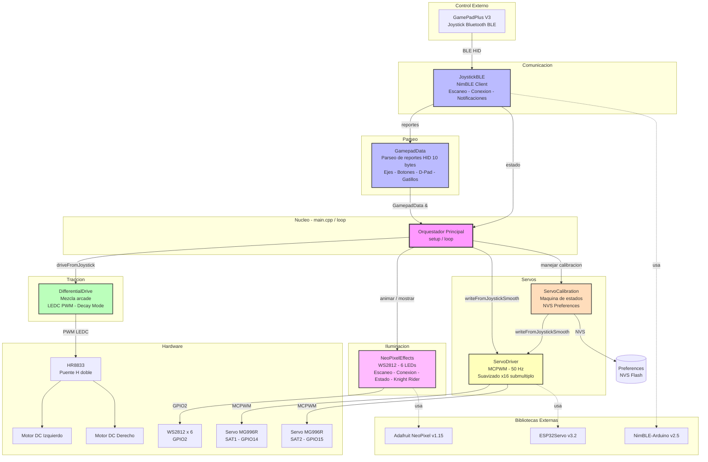
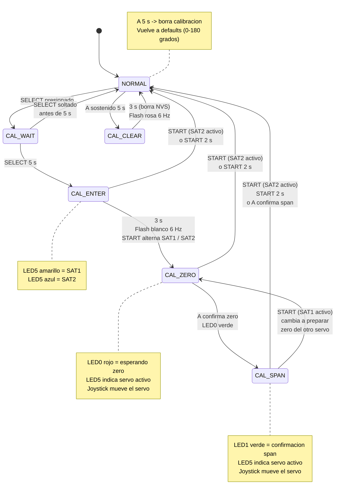
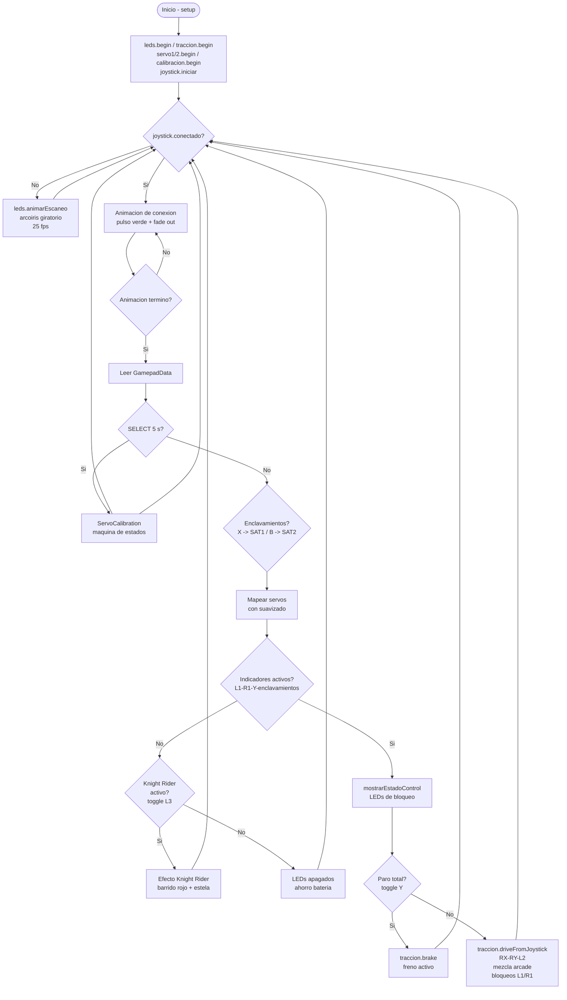
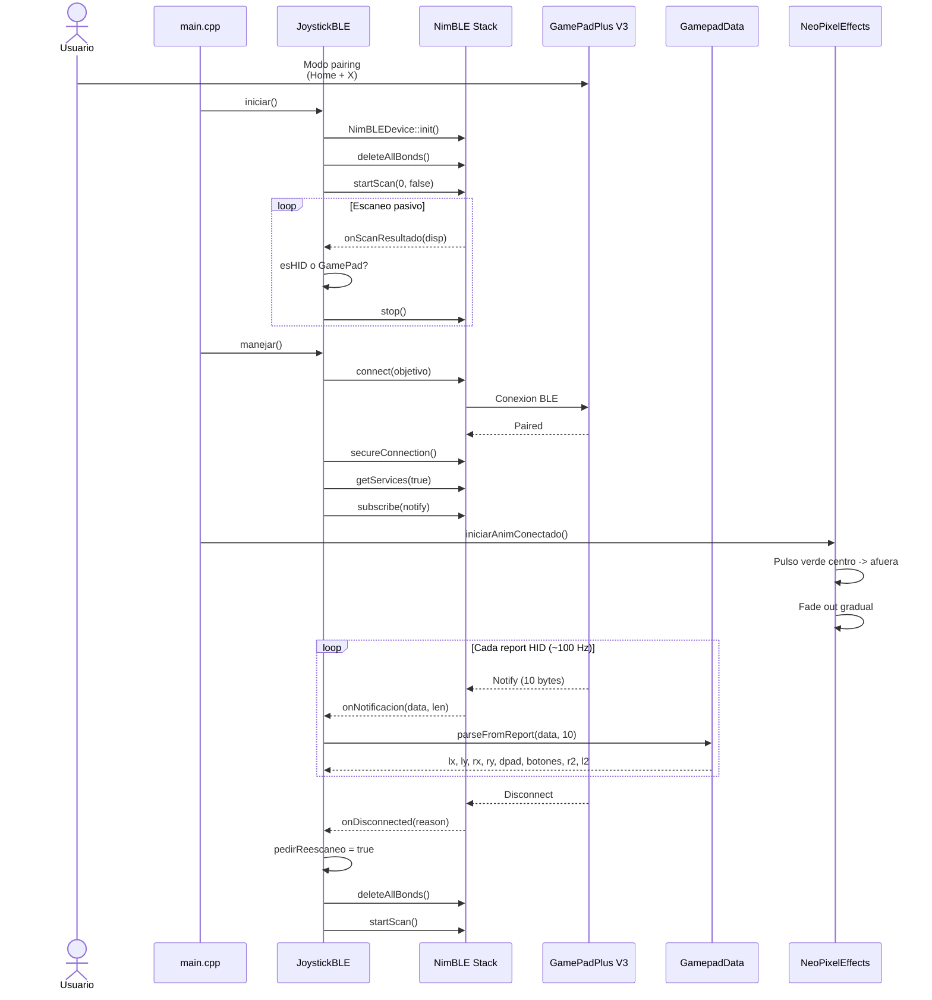
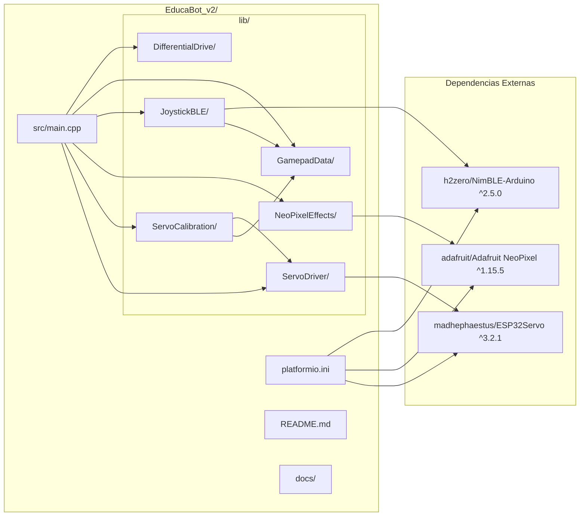

# UML del Proyecto EducaBot v2

> **Autor:** Prof. Fernando Angel Liozzi — 2026
>
> Robot educativo de traccion diferencial controlado por joystick Bluetooth BLE.
> ESP32-S3 + Arduino + PlatformIO. 6 bibliotecas propias + 3 externas.

---

## 1. Diagrama de Arquitectura de Componentes

---

## 2. Diagrama de Clases

```mermaid
classDiagram
    direction TB

    class GamepadData {
        <<struct>>
        +uint8_t lx, ly, rx, ry
        +uint8_t dpad
        +uint8_t l2, r2
        +uint16_t botones
        +bool parseFromReport(data, len)
        +void printToSerial()
        +void printCompact()
        +bool botonPresionado(mask)
        +static nombreDpad(v) string
        +static nombresBotones(mask, buf, size)
    }

    class JoystickBLE {
        -GamepadData gamepad
        -uint8_t ultimoReport[20]
        -NimBLEAdvertisedDevice* objetivo
        -NimBLEClient* cliente
        -bool encontrado
        -bool pedirReescaneo
        -bool verbose
        +void iniciar()
        +void manejar()
        +bool conectado()
        +GamepadData& estado()
        +void setVerbose(bool)
        +void onNotificacion(car, data, len, isNotif)
        +void onDisconnected(reason)
        +void onScanResultado(disp)
        -void iniciarEscaneo()
        -void conectarYExplorar()
    }

    class NeoPixelEffects {
        -Adafruit_NeoPixel tira
        -uint8_t numLeds
        -uint8_t brilloGlobal
        -uint8_t brilloEscaneo
        -uint8_t tonoBase
        -FaseConectado faseConectado
        +void begin(pin, cantidad)
        +void setBrightness(brillo)
        +void animarEscaneo()
        +void iniciarAnimConectado()
        +bool actualizarAnimConectado()
        +bool animConectadoTerminada()
        +void mostrarEstadoControl(bloqueoGiro, bloqueoAvance, paroTotal)
        +void apagar()
        +Adafruit_NeoPixel& getStrip()
    }

    class DifferentialDrive {
        -MotorPins motorIzq
        -MotorPins motorDer
        -Config cfg
        +DifferentialDrive(izq, der)
        +DifferentialDrive(izq, der, config)
        +void begin()
        +void stop()
        +void brake()
        +void driveFromJoystick(rx, ry, l2)
        +void setDecayMode(mode)
        +void setPrecisionPwmMax(pwm)
        -int16_t axisToSigned(raw, invert)
        -int16_t applyL2Attenuation(valor, l2)
        -void writeMotor(motor, comando)
        -void writeChannels(activeCh, inactiveCh, pwm)
    }

    class DifferentialDrive.MotorPins {
        <<struct>>
        +uint8_t in1, in2
        +uint8_t channel1, channel2
        +bool invertido
    }

    class DifferentialDrive.Config {
        <<struct>>
        +uint32_t pwmFrequency = 10000
        +uint8_t pwmResolutionBits = 8
        +uint8_t pwmMax = 255
        +uint8_t pwmPrecisionMax = 150
        +uint8_t joystickCenter = 128
        +uint8_t joystickDeadzone = 16
        +DecayMode decayMode = Slow
        +bool brakeAtZero = false
    }

    class DifferentialDrive.DecayMode {
        <<enumeration>>
        Slow
        Fast
    }

    class ServoDriver {
        -Servo servo
        -uint8_t pin
        -uint16_t currentAngle_x16
        -unsigned long lastSmoothMs
        -bool smoothInit
        +void begin(pin)
        +void writeAngle(angulo)
        +void writeFromJoystick(eje, zero, span, ejeLY)
        +void writeFromJoystickSmooth(eje, zero, span, r2, ejeLY, enCalibracion)
        +uint8_t getCurrentAngle()
        +void detach()
    }

    class ServoCalibration {
        -Estado estado = NORMAL
        -uint8_t servoIdx
        -uint16_t zero[2], span[2]
        -unsigned long tiempoEstado, ultimoFlash, startPresionadoMs, aPresionadoMs
        -bool flashState, selectAnterior, startAnterior, aAnterior
        +void begin()
        +void manejar(gamepad, tira, servo1, servo2)
        +bool enCalibracion()
        +uint16_t getZero(idx)
        +uint16_t getSpan(idx)
        +uint8_t servoActivo()
        -void guardar()
        -void cargar()
        -void limpiarTira(tira)
    }

    class ServoCalibration.Estado {
        <<enumeration>>
        NORMAL
        CAL_CLEAR
        CAL_WAIT
        CAL_ENTER
        CAL_ZERO
        CAL_SPAN
    }

    class Adafruit_NeoPixel {
        <<externo>>
        begin()
        setPixelColor()
        setBrightness()
        getBrightness()
        clear()
        show()
        Color()
    }

    class Servo {
        <<externo - ESP32Servo>>
        attach()
        write()
        detach()
        setPeriodHertz()
    }

    class Preferences {
        <<externo - NVS>>
        begin()
        getUShort()
        putUShort()
        end()
    }

    %% Relaciones
    JoystickBLE *-- GamepadData : "contiene 1"
    JoystickBLE --> GamepadData : "usa"
    ServoCalibration --> GamepadData : "lee botones"
    ServoCalibration --> ServoDriver : "controla 2"
    ServoCalibration --> Adafruit_NeoPixel : "senaliza"
    ServoCalibration --> Preferences : "persiste"
    NeoPixelEffects --> Adafruit_NeoPixel : "contiene 1"
    ServoDriver --> Servo : "contiene 1"
    DifferentialDrive *-- DifferentialDrive.MotorPins : "2 motores"
    DifferentialDrive *-- DifferentialDrive.Config : "configuracion"

    %% main.cpp instancia
    note for JoystickBLE "Global: joystick"
    note for NeoPixelEffects "Global: leds"
    note for ServoDriver "Global: servo1, servo2"
    note for ServoCalibration "Global: calibracion"
    note for DifferentialDrive "Global: traccion"
```

---

## 3. Máquina de Estados — Calibración de Servos

---

## 4. Flujo Principal del Programa

---

## 5. Diagrama de Secuencia — Conexión BLE

---

## 6. Dependencias y Estructura de Archivos

---

## 7. Resumen de Relaciones entre Clases

| Clase                 | Depende de                                                       | Rol                                                               |
| --------------------- | ---------------------------------------------------------------- | ----------------------------------------------------------------- |
| **JoystickBLE**       | `GamepadData`, NimBLE                                            | Cliente BLE: escanea, conecta, recibe notificaciones HID          |
| **GamepadData**       | — (struct puro)                                                  | Parseo de reportes HID de 10 bytes -> ejes, botones, D-pad        |
| **DifferentialDrive** | LEDC (ESP32)                                                     | Mezcla arcade + PWM para 2 motores DC vía HR8833                  |
| **NeoPixelEffects**   | `Adafruit_NeoPixel`                                              | Animaciones LED: escaneo arcoíris, conexión, estado, Knight Rider |
| **ServoDriver**       | `ESP32Servo` (MCPWM)                                             | Capa de hardware: attach, write, suavizado continuo               |
| **ServoCalibration**  | `ServoDriver`, `GamepadData`, `Adafruit_NeoPixel`, `Preferences` | Máquina de estados de calibración con persistencia NVS            |
| **main.cpp**          | Todos los anteriores                                             | Orquestador: setup, loop, lógica Knight Rider, enclavamientos     |
